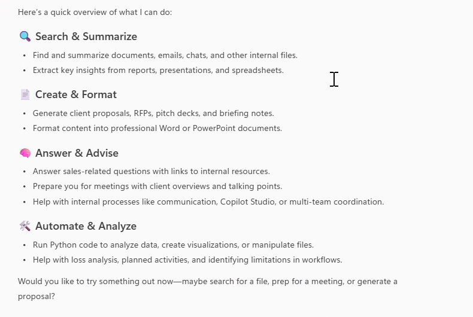
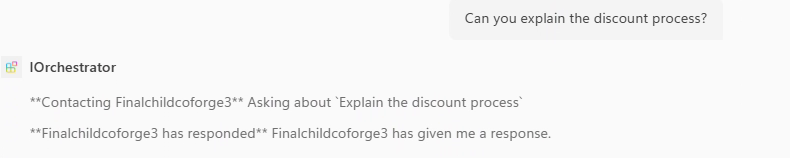

# Smart Router - Multi-agent orchestration for sales teams

## Summary

Smart Router is a multi-agent pattern for Microsoft 365 Copilot built entirely from declarative agents. An orchestrator agent detects the intent behind each request and routes it to one of six specialised worker agents, so sellers can ask for a proposal, a policy answer, meeting prep, a briefing note, a content review, or a pitch deck without having to pick the right agent themselves.

The orchestrator connects to its workers through the `worker_agents` property in its declarative agent definition. Each of the seven agents is a self-contained Microsoft 365 Agents Toolkit project, so they can be provisioned and updated independently.

The orchestrator describing what the set of agents can do:



Routing in action. The user asks a sales question, and the orchestrator hands it to the worker agent that owns that intent:



> The screenshots come from the original recording of this scenario, in which the agents still carried their development names (`IOrchestrator` and `Finalchildcoforge3`). They are named **Smart Router** and **Sales FAQ** in this sample.

https://github.com/user-attachments/assets/e1af6920-f25c-4065-aca0-47cc36ec7462

## Contributors

* [Keshav Keshari](https://github.com/keshavk-msft)

## Version history

Version|Date|Comments
-------|----|--------
1.0|August 24, 2026|Initial release

## Prerequisites

* [Microsoft 365 Copilot license](https://learn.microsoft.com/microsoft-365-copilot/extensibility/prerequisites#prerequisites)
* A [Microsoft 365 account for development](https://learn.microsoft.com/microsoftteams/platform/toolkit/accounts)
* [Microsoft 365 Agents Toolkit for Visual Studio Code](https://aka.ms/teams-toolkit) or [Microsoft 365 Agents Toolkit CLI](https://aka.ms/teamsfx-toolkit-cli)

## Minimal path to awesome

* Clone this repository (or [download this solution as a .ZIP file](https://pnp.github.io/download-partial/?url=https://github.com/pnp/copilot-pro-dev-samples/tree/main/samples/da-smart-router-multiagent) then unzip it)

Deploy the six worker agents **before** the orchestrator, because the orchestrator has to reference their agent IDs.

* For each folder under `workers`, in turn:
  * Open the worker folder in Visual Studio Code
  * Select the Microsoft 365 Agents Toolkit icon on the left in the VS Code toolbar
  * In the **Accounts** section, sign in with your [Microsoft 365 account](https://learn.microsoft.com/microsoftteams/platform/toolkit/accounts) if you haven't already
  * Select **Provision** in the **Lifecycle** section
  * Once provisioning finishes, note the **title ID** that was created. A title ID is a single letter, an underscore, and a GUID, for example `U_1e0e57ab-2c86-4e70-8dc7-9a4f1a4d0c62`. It is shown in the output of the **Provision** command, and can also be found in the agent metadata section of the [developer mode](https://learn.microsoft.com/microsoft-365-copilot/extensibility/debugging-agents-copilot-studio) card

* Wire the workers into the orchestrator:
  * Open `orchestrator/appPackage/declarativeAgent.json`
  * Replace each `U_xxxxxxxx-xxxx-xxxx-xxxx-xxxxxxxxxxxx` placeholder in `worker_agents` with one of the title IDs you collected
  * Remove any entries you don't need if you deployed fewer than six workers

* Deploy the orchestrator:
  * Open the `orchestrator` folder in Visual Studio Code
  * Select **Provision** in the **Lifecycle** section
  * Select `Preview in Copilot (Edge)` or `Preview in Copilot (Chrome)` from the launch configuration dropdown
  * Once the Copilot app is loaded in the browser, select the "..." menu and select **Copilot chats**. You will see **Smart Router** on the right rail. Selecting it will change the experience to showcase the agent
  * Ask the agent for a proposal, a sales policy answer, or meeting prep, and it will route the request to the matching worker agent

## Features

Using this sample you can extend Microsoft 365 Copilot with a set of agents that:

* Route a request to a specialised agent based on detected intent, rather than making the user choose
* Generate client proposals as formatted Word documents
* Answer common sales process and policy questions
* Summarise client context, recent interactions, and talking points before a meeting
* Format meeting notes into a fixed meeting brief template
* Review content for clarity, structure, tone, consistency, and completeness
* Build pitch decks by reusing existing case studies and service descriptions

### Architecture

```
                         ┌─────────────────────┐
                         │        User         │
                         └──────────┬──────────┘
                                    │
                                    ▼
                         ┌─────────────────────┐
                         │    Smart Router     │
                         │   (Intent Router)   │
                         └──────────┬──────────┘
                                    │
           ┌────────────┬───────────┼───────────┬────────────┬────────────┐
           ▼            ▼           ▼           ▼            ▼            ▼
    ┌────────────┐ ┌─────────┐ ┌─────────┐ ┌─────────┐ ┌─────────┐ ┌─────────┐
    │ Proposal   │ │ Sales   │ │ Meeting │ │Briefing │ │ Content │ │Proactive│
    │ Generator  │ │   FAQ   │ │ Preparer│ │Formatter│ │ Checker │ │Proposal │
    └────────────┘ └─────────┘ └─────────┘ └─────────┘ └─────────┘ └─────────┘
```

### Agents

| Agent | Purpose | Capabilities |
|-------|---------|--------------|
| **Smart Router** | Detects intent and routes the request to the right worker agent | OneDriveAndSharePoint, CodeInterpreter |
| Proposal Generator | Creates client proposals as Word documents | OneDriveAndSharePoint, CodeInterpreter |
| Sales FAQ | Answers common sales process and policy questions | None |
| Client Meeting Preparer | Summarises client context and talking points | Meetings |
| Briefing Note Formatter | Formats meeting notes into a fixed template | None |
| Content Quality Checker | Reviews content quality and returns prioritised feedback | OneDriveAndSharePoint, CodeInterpreter |
| Proactive Proposal | Builds pitch decks from existing content | OneDriveAndSharePoint, CodeInterpreter |

### Connecting worker agents

The orchestrator references its workers by title ID in `orchestrator/appPackage/declarativeAgent.json`, using the `worker_agents` property introduced in declarative agent schema v1.6:

```json
"worker_agents": [
    { "id": "U_xxxxxxxx-xxxx-xxxx-xxxx-xxxxxxxxxxxx" },
    { "id": "U_xxxxxxxx-xxxx-xxxx-xxxx-xxxxxxxxxxxx" }
]
```

These IDs only exist once a worker has been provisioned, which is why the workers are deployed first. Users must also install each worker agent before the orchestrator can route to it.

Copilot chooses which worker to route to based on each worker's `name`, `description`, and `conversation_starters` — not on the orchestrator's instructions alone. If routing sends a request to the wrong agent, sharpen the worker `description` values first, then refine the routing rules in `orchestrator/appPackage/instruction.txt`.

Connected agents exchange text only. Workers can't return files, images, or adaptive cards to the orchestrator, so the Proposal Generator and Proactive Proposal agents are best used directly when a document or deck is the deliverable.

### Project structure

| Folder/File | Contents |
|-------------|----------|
| `orchestrator` | Microsoft 365 Agents Toolkit project for the routing agent |
| `workers` | One Microsoft 365 Agents Toolkit project per specialised worker agent |
| `<project>/.vscode` | VS Code files for debugging |
| `<project>/appPackage` | Templates for the Teams application manifest and the declarative agent definition |
| `<project>/appPackage/declarativeAgent.json` | Defines the behaviour and configuration of the declarative agent |
| `<project>/appPackage/instruction.txt` | Agent instructions |
| `<project>/appPackage/manifest.json` | Teams application manifest that defines metadata for the declarative agent |
| `<project>/env` | Environment files |
| `<project>/m365agents.yml` | Main Microsoft 365 Agents Toolkit project file with provision and publish lifecycle definitions |

## Help

We do not support samples, but this community is always willing to help, and we want to improve these samples. We use GitHub to track issues, which makes it easy for  community members to volunteer their time and help resolve issues.

You can try looking at [issues related to this sample](https://github.com/pnp/copilot-pro-dev-samples/issues?q=label%3A%22sample%3A%20da-smart-router-multiagent%22) to see if anybody else is having the same issues.

If you encounter any issues using this sample, [create a new issue](https://github.com/pnp/copilot-pro-dev-samples/issues/new).

Finally, if you have an idea for improvement, [make a suggestion](https://github.com/pnp/copilot-pro-dev-samples/issues/new).

## Disclaimer

**THIS CODE IS PROVIDED *AS IS* WITHOUT WARRANTY OF ANY KIND, EITHER EXPRESS OR IMPLIED, INCLUDING ANY IMPLIED WARRANTIES OF FITNESS FOR A PARTICULAR PURPOSE, MERCHANTABILITY, OR NON-INFRINGEMENT.**


