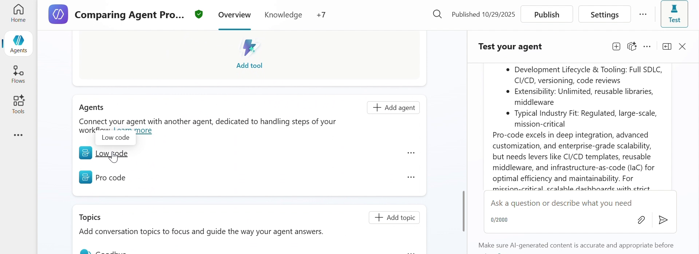
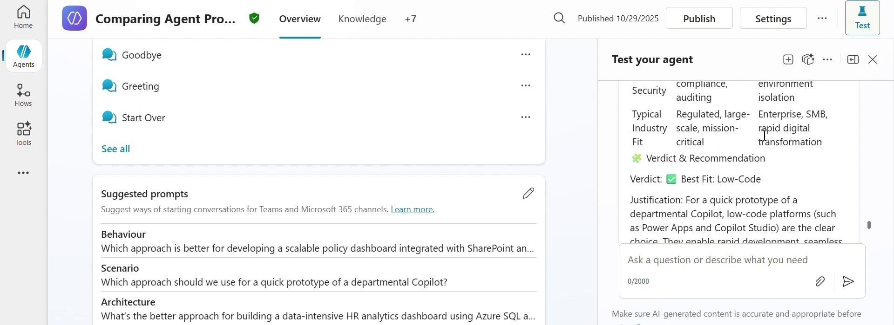

# Pro-Code vs Low-Code Comparison - Multi-agent decision support

## Summary

Choosing between a pro-code and a low-code approach is a decision teams make over and over, and it drives development speed, total cost of ownership, scalability, governance, and the skills a team needs to hire for. The answer usually depends on who you ask.

This sample settles that with a **multi-agent pattern in Microsoft Copilot Studio**. An orchestrator agent takes the user's question, triggers a **pro-code** child agent and a **low-code** child agent in parallel with the same normalized prompt, and merges their two perspectives into a single structured report.



Every answer follows the same shape, so two different questions produce reports you can put side by side:

| Section | Contents |
|---------|----------|
| **User Query** | The original question, highlighted |
| **Offer Comparison Summary** | Table across 11 fixed parameters: tools and stack, target users, skill requirement, development speed, flexibility, governance, cost, maintenance ownership, integration depth, ROI orientation, typical use case |
| **Comparison Highlights** | Table across 11 criteria, reordered so the ones matching the question appear first |
| **Verdict and Recommendation** | Best fit, a justification tied to the emphasized criteria, and why the other option cannot win |
| **Levers to Improve Competitiveness** | Concrete actions that would make the weaker option viable |
| **Summary Insights** | Executive wrap-up, including when to pivot to a hybrid approach |



> The screenshots come from the original recording of this scenario, where the orchestrator still carried its development name, `Comparing Agent Production`. It is named **Pro-Code vs Low-Code Comparison** in this sample.

## Contributors

* [Keshav Keshari](https://github.com/keshavk-msft)

## Version history

Version|Date|Comments
-------|----|--------
1.0|August 24, 2026|Initial release

## Prerequisites

* A [Microsoft Copilot Studio](https://learn.microsoft.com/microsoft-copilot-studio/requirements-licensing-subscriptions) license
* A Power Platform environment with Dataverse
* [Power Platform CLI](https://learn.microsoft.com/power-platform/developer/cli/introduction) to import the solution

## Minimal path to awesome

* Clone this repository (or [download this solution as a .ZIP file](https://pnp.github.io/download-partial/?url=https://github.com/pnp/copilot-pro-dev-samples/tree/main/samples/mcs-procode-vs-lowcode-comparison) then unzip it)

### Copilot Studio using Solution Import

This sample uses the Power Platform CLI to import the agent. For installation instructions see [What is Microsoft Power Platform CLI?](https://learn.microsoft.com/power-platform/developer/cli/introduction)

* Ensure you are authenticated with `pac auth create`

```powershell
cd samples/mcs-procode-vs-lowcode-comparison

# Package up the solution. Pointing at ./src is important.
pac solution pack --zipfile mcs-procode-vs-lowcode-comparison.zip --folder ./src

# Import into a specific environment with -env, or leave it off for the default environment
pac env list
pac solution import --path ./mcs-procode-vs-lowcode-comparison.zip
```

* Open [Copilot Studio](https://copilotstudio.microsoft.com), select the environment you imported into, and open the **Pro-Code vs Low-Code Comparison** agent
* Select **Publish** to make the agent available
* Open the **Test your agent** pane and try one of the conversation starters, or ask your own comparison question

## Features

Using this sample you can build a Copilot Studio agent that:

* Coordinates two child agents from a single orchestrator, rather than packing every perspective into one set of instructions
* Triggers both child agents in parallel with the same normalized question, so neither perspective sees the other's answer first
* Keeps each perspective's expertise scoped to its own agent, which keeps the instructions short and focused
* Returns a consistent, tabular report for every question, so answers are comparable over time
* Names the losing option's specific constraints and the levers that would change the verdict, instead of stopping at a recommendation

### Agents

| Agent | Role |
|-------|------|
| **Pro-Code vs Low-Code Comparison** | Orchestrator. Normalizes the question, triggers both children in parallel, merges the responses into the final report |
| **Pro code** | Covers Microsoft 365 Agents Toolkit, Bot Framework, Microsoft Agent Framework, Azure Functions, App Service, Kubernetes, Microsoft Graph SDKs, Azure OpenAI, Azure AI Search, Key Vault, Application Insights |
| **Low code** | Covers Copilot Studio, Agent Builder, Power Automate, Power Apps, Power BI, Power Pages, Dataverse, and standard connectors |

Each child agent is stored as a `botcomponent` of type `9` with `kind: AgentDialog`, alongside the orchestrator's `gpt.default` component and the system topics.

### Solution structure

| Folder/File | Contents |
|-------------|----------|
| `ProCodeVsLowCodeComparison.cdsproj` | Dataverse solution project file |
| `src/Other` | Solution manifest and customizations |
| `src/bots` | The orchestrator agent definition and its configuration |
| `src/botcomponents/*.agent.procode` | The pro-code child agent |
| `src/botcomponents/*.agent.lowcode` | The low-code child agent |
| `src/botcomponents/*.gpt.default` | Orchestrator instructions and conversation starters |
| `src/botcomponents/*.topic.*` | System topics |

## Help

We do not support samples, but this community is always willing to help, and we want to improve these samples. We use GitHub to track issues, which makes it easy for  community members to volunteer their time and help resolve issues.

You can try looking at [issues related to this sample](https://github.com/pnp/copilot-pro-dev-samples/issues?q=label%3A%22sample%3A%20mcs-procode-vs-lowcode-comparison%22) to see if anybody else is having the same issues.

If you encounter any issues using this sample, [create a new issue](https://github.com/pnp/copilot-pro-dev-samples/issues/new).

Finally, if you have an idea for improvement, [make a suggestion](https://github.com/pnp/copilot-pro-dev-samples/issues/new).

## Disclaimer

**THIS CODE IS PROVIDED *AS IS* WITHOUT WARRANTY OF ANY KIND, EITHER EXPRESS OR IMPLIED, INCLUDING ANY IMPLIED WARRANTIES OF FITNESS FOR A PARTICULAR PURPOSE, MERCHANTABILITY, OR NON-INFRINGEMENT.**


